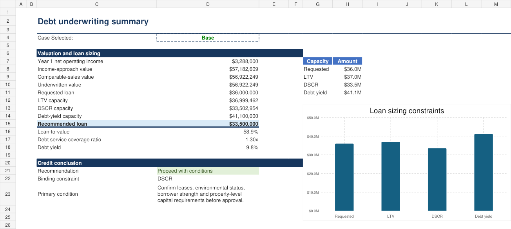

# DebtLens

**Inspect the property cash flow. Size the loan. Explain the credit decision.**

DebtLens is a commercial real-estate debt underwriting portfolio lab built around a fictional Metro Vancouver industrial property. It combines an auditable Excel model, matching Python calculations, a Streamlit scenario interface, unit tests and a preliminary investment memorandum.

All property, borrower and comparable-sale details are synthetic. This project does not represent professional underwriting experience, an actual transaction or an affiliation with QuadReal Property Group.

## Base-case conclusion

The fictional borrower requests CAD 36.0 million. The model recommends CAD 33.5 million because the 1.30x minimum DSCR is the binding lender constraint.

| Metric | Base result |
|---|---:|
| Year 1 NOI | CAD 3.288M |
| Underwritten value | CAD 56.922M |
| Recommended loan | CAD 33.500M |
| LTV | 58.9% |
| DSCR | 1.30x |
| Debt yield | 9.8% |
| Five-year maturity balance | CAD 30.018M |



## Repository contents

- [`model/DebtLens_Underwriting_Model.xlsx`](model/DebtLens_Underwriting_Model.xlsx): assumptions, operating forecast, comparable sales, loan sizing, amortization, sensitivities and audit checks.
- [`app.py`](app.py): interactive scenario review for vacancy, interest rate and capitalization rate.
- [`src/debtlens/model.py`](src/debtlens/model.py): deterministic Python implementation of the underwriting mechanics.
- [`docs/INVESTMENT_MEMO.md`](docs/INVESTMENT_MEMO.md): preliminary recommendation, risks and approval conditions.
- [`docs/METHODOLOGY.md`](docs/METHODOLOGY.md): calculation definitions and model logic.
- [`docs/VALIDATION.md`](docs/VALIDATION.md): executed checks, base-case agreement and unverified items.
- [`docs/REVIEW_QUESTIONS.md`](docs/REVIEW_QUESTIONS.md): interview questions for explaining the model.

## Run the Python checks

Requires Python 3.11+.

```bash
python -m venv .venv
# Windows PowerShell
.venv\Scripts\Activate.ps1
# macOS/Linux: source .venv/bin/activate
python -m pip install -e .
python -m unittest discover -s tests -v
python scripts/validate_model.py
```

## Run the dashboard

```bash
python -m pip install -r requirements.txt
python -m streamlit run app.py
```

## What the model demonstrates

- Five-year property cash-flow forecasting.
- Income-capitalization and comparable-sales valuation.
- Loan sizing using requested amount, LTV, DSCR and debt-yield limits.
- Fixed-rate monthly amortization and maturity-balance calculation.
- Interest-rate, vacancy, capitalization-rate and valuation sensitivities.
- Explicit due-diligence gaps, credit conditions and audit checks.
- Cross-implementation agreement between Excel and Python.

## AI-assisted development

AI assistance was used to accelerate initial scaffolding, identify test cases, review formula references and improve documentation. Sanjayan Visagendran is responsible for reviewing the assumptions, running the checks, understanding the calculations and explaining the resulting credit recommendation. AI output is treated as draft material until independently checked.

## Important limitations

- No actual borrower, tenant, lease, market or transaction data is included.
- Comparable sales are fictional and do not support a real valuation.
- The model omits taxes, reserves, tenant improvements, leasing commissions, legal structure, guarantees and construction-loan mechanics.
- No Argus Enterprise model or third-party appraisal is included.
- Passing tests establishes internal consistency for the stated assumptions, not investment suitability.

## Suggested next step

Ask a real-estate debt professional to identify one missing diligence item or model assumption. Record the feedback, make the change yourself and explain why the credit conclusion did or did not change.

## License

MIT. See [`LICENSE`](LICENSE).
